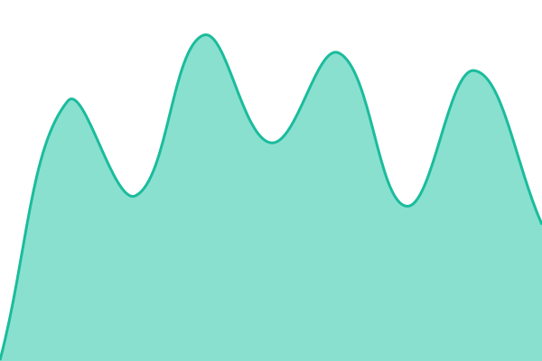
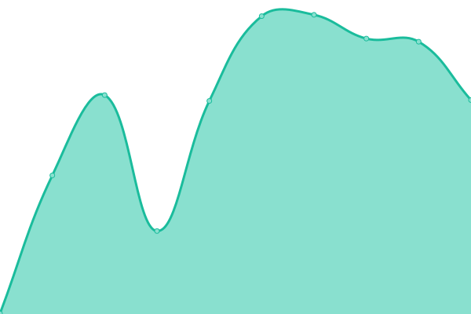

# [📈 Live Status](https://status.treeplex.ca): <!--live status--> **🟩 All systems operational**

This repository contains the open-source uptime monitor and status page for [troyervin](https://status.treeplex.ca), powered by [Upptime](https://github.com/upptime/upptime).

With [Upptime](https://upptime.js.org), you can get your own unlimited and free uptime monitor and status page, powered entirely by a GitHub repository. We use [Issues](https://github.com/troyervin/treeplex-status/issues) as incident reports, [Actions](https://github.com/troyervin/treeplex-status/actions) as uptime monitors, and [Pages](https://status.treeplex.ca) for the status page.

<!--start: status pages-->
<!-- This summary is generated by Upptime (https://github.com/upptime/upptime) -->
<!-- Do not edit this manually, your changes will be overwritten -->
<!-- prettier-ignore -->
| URL | Status | History | Response Time | Uptime |
| --- | ------ | ------- | ------------- | ------ |
|  [TreePlex Server](https://home.treeplex.ca) | 🟩 Up | [tree-plex-server.yml](https://github.com/troyervin/treeplex-status/commits/HEAD/history/tree-plex-server.yml) | 

 300ms
     
 | 

<a href="https://status.treeplex.ca/history/tree-plex-server">100.00%</a>
    

|  [Plex](https://plex.treeplex.ca/web/index.html) | 🟩 Up | [plex.yml](https://github.com/troyervin/treeplex-status/commits/HEAD/history/plex.yml) | 

 274ms
     
 | 

<a href="https://status.treeplex.ca/history/plex">100.00%</a>
    

|  [Emby](https://emby.treeplex.ca/System/Info/Public) | 🟩 Up | [emby.yml](https://github.com/troyervin/treeplex-status/commits/HEAD/history/emby.yml) | 

 573ms
     
 | 

<a href="https://status.treeplex.ca/history/emby">100.00%</a>
    

|  [Overseerr](https://add.treeplex.ca) | 🟩 Up | [overseerr.yml](https://github.com/troyervin/treeplex-status/commits/HEAD/history/overseerr.yml) | 

 829ms
     
 | 

<a href="https://status.treeplex.ca/history/overseerr">100.00%</a>
    

|  [HomeAssistant](https://ha.treeplex.ca) | 🟩 Up | [home-assistant.yml](https://github.com/troyervin/treeplex-status/commits/HEAD/history/home-assistant.yml) | 

 628ms
     
 | 

<a href="https://status.treeplex.ca/history/home-assistant">100.00%</a>
    

<!--end: status pages-->

[**Visit our status website →**](https://status.treeplex.ca)

## 📄 License

- Powered by: [Upptime](https://github.com/upptime/upptime)
- Code: [MIT](./LICENSE) © [Anand Chowdhary](https://anandchowdhary.com), supported by [Pabio](https://pabio.com)
- Data in the `./history` directory: [Open Database License](https://opendatacommons.org/licenses/odbl/1-0/)
